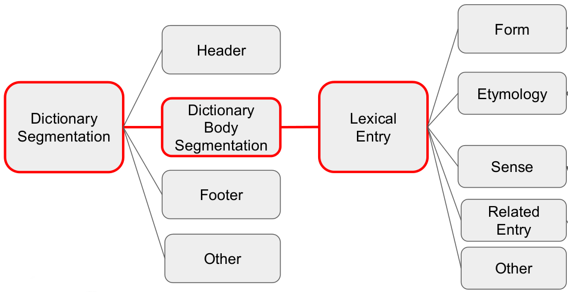

# GROBID-Dictionaries

[](http://www.apache.org/licenses/LICENSE-2.0.html)
[](Readme.md)
[](https://readthedocs.org/projects/grobid-dictionaries/?badge=latest) 
[](https://hub.docker.com/r/medkhem/grobid-dictionaries/builds/)
## Purpose

GROBID-Dictionaries is a GROBID sub-module, implementing a java machine learning library, for structuring digitized lexical resources. It allows the parsing, extraction and structuring of text information in such resources. 

## To Cite

Mohamed Khemakhem, Luca Foppiano, Laurent Romary. Automatic Extraction of TEI Structures in Digitized Lexical Resources using Conditional Random Fields. electronic lexicography, eLex 2017, Sep 2017, Leiden, Netherlands. <hal-01508868v2>
```@inproceedings{khemakhem:hal-01508868,
     TITLE = {{Automatic Extraction of TEI Structures in Digitized Lexical Resources using Conditional Random Fields}},
     AUTHOR = {Khemakhem, Mohamed and Foppiano, Luca and Romary, Laurent},
     URL = {https://hal.archives-ouvertes.fr/hal-01508868},
     BOOKTITLE = {{electronic lexicography, eLex 2017}},
     ADDRESS = {Leiden, Netherlands},
     YEAR = {2017},
     MONTH = Sep,
     KEYWORDS = { digitized dictionaries  ;  automatic structuring ;  CRF ;  TEI ; machine learning},
     PDF = {https://hal.archives-ouvertes.fr/hal-01508868/file/eLex-2017-Template.pdf},
     HAL_ID = {hal-01508868},
     HAL_VERSION = {v2},
   }
```

## Approach

GROBID-Dictionaries is based on cascading CRF models. The diagram below presents the architecture enabling the processing and the transfer of the text information through the models.



Each box represents a model and not a text structure. Every model allows the processing and the structuring of the information provided by its predecessor. 
The name of each model reflects the information to be processed per level. Consequently, the same appellation is used for naming the implemented java classes and their functionalities.
The boxes in red color represent the models which are already implemented, where the rest of the diagram corresponds to the pending components. 

__Dictionary Segmentation__
This is the first model and has as goal the segmentation of each dictionary page into 3 main blocks: Header, Body and Footer. Another block, "Other" could be generated for text information that do not belong to the principal blocks

__Dictionary Body Segmentation__
The second model gets the Body, recognized by the first model, and processes it to recognize the boundaries of each lexical entry.

__Lexical Entry__
The third model parses each lexical entry, recognized by the second model, to segment it into 4 main blocks: Form, Etymology, Senses, Related Entries. An "Other" block is there as well for unrecognised information. 


__The rest of the models__
The same logic applies respectively for the recognised blocks in the lexical entry by having a specific model for each one of them


*N.B*: The current architecture could change at any milestone of the project, as soon as new ideas or technical constraints emerge. 

## Input/Output

GROBID-Dictionaries takes as input lexical resources digitized in PDF format. Each model of the aforementioned components generates a TEI P5-encoded hierarchy of the different recognized text structures at that specific cascading level.

## Docker Use
To shortcut the installation of the tool, the [Docker manual](https://github.com/MedKhem/grobid-dictionaries/wiki/Docker_Instructions) could be followed to use the latest image of the tool

## Documentation
For more expert and development uses , the documentation of the tool is detailed [here](http://grobid-dictionaries.readthedocs.io/en/latest/)


## License

GROBID and GROBID-Dictionaries are distributed under [Apache 2.0 license](http://www.apache.org/licenses/LICENSE-2.0). 

Contact: Mohamed Khemakhem (<mohamed.khemakhem@inria.fr>), Patrice Lopez (<patrice.lopez@science-miner.com>), Luca Foppiano (<luca.foppiano@inria.fr>)
