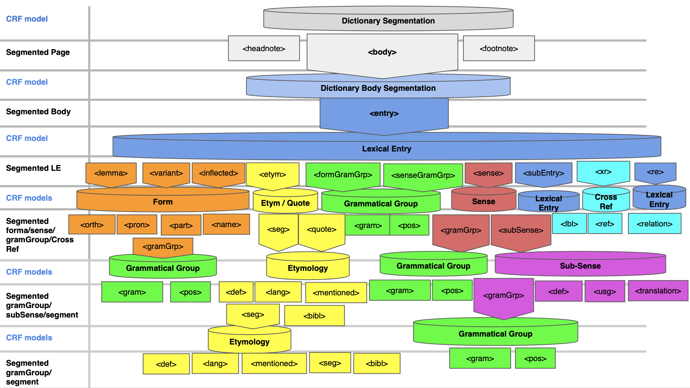

# GROBID-Dictionaries

 

## Purpose

GROBID-Dictionaries is a GROBID module, implementing a java machine learning library, for structuring digitised lexical resources and entry-based documents with encyclopedic or bibliographic content. It allows the parsing, extraction and structuring of text information in such resources. 

## Approach

GROBID-Dictionaries is based on cascading models. The diagram below presents the architecture enabling the processing and the transfer of the text information through the models.

__Dictionary Segmentation__
This is the first model and has as goal the segmentation of each dictionary page into 3 main blocks: Headnote, Body and Footnote. Another block, "dictScarp" could be generated for text information that do not belong to the principal blocks

__Dictionary Body Segmentation__
The second model gets the Body, recognised by the first model, and processes it to recognise the boundaries of each lexical entry.

__Lexical Entry__
The third model parses each lexical entry, recognised by the second model, to segment it into 4 main blocks: Form, Etymology, Senses, Related Entries. A "dictScrap" block is there as well for unrecognised information. 

__The rest of the models__
The same logic respectively applies for the recognised blocks in a lexical entry by having a specific model for each one of them

*N.B*: The current architecture could change at any milestone of the project, as soon as new ideas or technical constraints emerge. 

## Input/Output

GROBID-Dictionaries takes as input a file in PDF or ALTO formats. Each model of the aforementioned components generates a TEI P5-encoded hierarchy of the different recognised text structures at that specific cascading level. The final serialised output is in-line with new version of LMF (Romary et al. 2019) and the TEI-Lex-0 initiative (Romary and Tasovac 2019).

## Demo

The most recent version of the system is available [online](https://traces1.inria.fr/grobid-dictionaries/). The models of this version are trained with [samples](https://github.com/MedKhem/grobid-dictionaries_data/tree/master/Training_Data%26Evaluation) from [5 different dictionaries](https://github.com/MedKhem/grobid-dictionaries_data/tree/master/Raw_Documents) that you can download and parse with GROBID-Dictionaries.
This [video](https://www.youtube.com/watch?v=u9PhaJA8awk) illustrates a use case of different models of the system.  

## Docker Use
To shortcut the installation of the tool, the [Docker manual](https://github.com/MedKhem/grobid-dictionaries/wiki/Docker_Instructions) can be followed to use the latest image of the tool.

## To Cite

Mohamed Khemakhem, Luca Foppiano, Laurent Romary. Automatic Extraction of TEI Structures in Digitized Lexical Resources using Conditional Random Fields. electronic lexicography, eLex 2017, Sep 2017, Leiden, Netherlands. [hal-01508868v2](https://hal.archives-ouvertes.fr/hal-01508868v2)

Mohamed Khemakhem, Axel Herold, Laurent Romary. Enhancing Usability for Automatically Structuring Digitised Dictionaries. GLOBALEX workshop at LREC 2018, May 2018, Miyazaki, Japan. 2018.  [hal-01708137v2](https://hal.archives-ouvertes.fr/hal-01708137v2)

## More Reading
Romary, Laurent et al. (2019). “LMF Reloaded”. In: AsiaLex 2019: Past, Present and Future. Istanbul, Turkey.

Romary, Laurent and Toma Tasovac (2018). “TEI Lex-0: A Target Format for TEI-Encoded Dictionaries and Lexical Resources”. In: TEI Conference and Members’ Meeting. Tokyo, Japan.

Hervé Bohbot, Francesca Frontini, Giancarlo Luxardo, Mohamed Khemakhem, Laurent Romary. Presenting the Nénufar Project: a Diachronic Digital Edition of the Petit Larousse Illustré. GLOBALEX 2018 - Globalex workshop at LREC2018, May 2018, Miyazaki, Japan. [hal-01728328](https://hal.archives-ouvertes.fr/hal-01728328v1)

Mohamed Khemakhem, Carmen Brando, Laurent Romary, Frédérique Mélanie-Becquet, Jean-Luc Pinol. Fueling Time Machine: Information Extraction from Retro-Digitised Address Directories. JADH2018 "Leveraging Open Data", Sep 2018, Tokyo, Japan.  [hal-01814189](https://hal.archives-ouvertes.fr/hal-01814189v1)

Mohamed Khemakhem, Laurent Romary, Simon Gabay, Hervé Bohbot, Francesca Frontini, et al.. Automatically Encoding Encyclopedic-like Resources in TEI. The annual TEI Conference and Members Meeting, Sep 2018, Tokyo, Japan.[hal-01819505](https://hal.archives-ouvertes.fr/hal-01819505v1)

David Lindemann, Mohamed Khemakhem, Laurent Romary. Retro-digitizing and Automatically Structuring a Large Bibliography Collection. European Association for Digital Humanities (EADH) Conference, Dec 2018, Galway, Ireland. [hal-01941534](https://hal.archives-ouvertes.fr/hal-01941534v1)

## Documentation
For more expert and development usage, the documentation of the tool is detailed [here](http://grobid-dictionaries.readthedocs.io/en/latest/)

## Contact
Mohamed Khemakhem (<mohamed.khemakhem@inria.fr>), Laurent Romary (<laurent.romary@inria.fr>)
